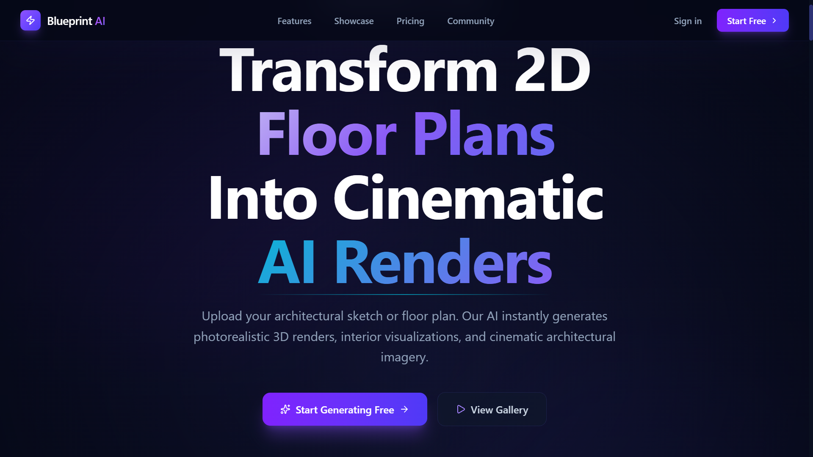
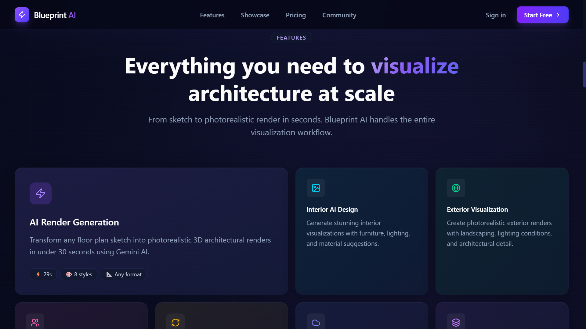
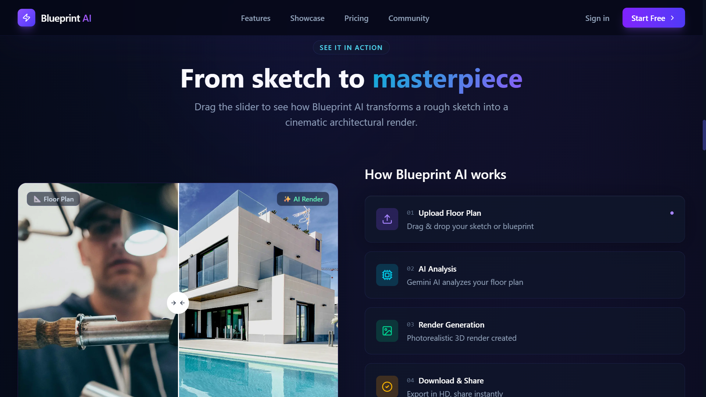
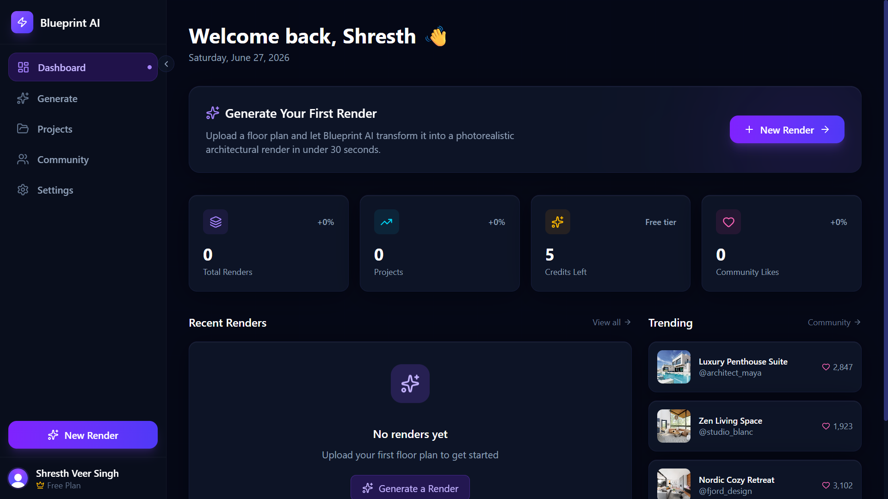
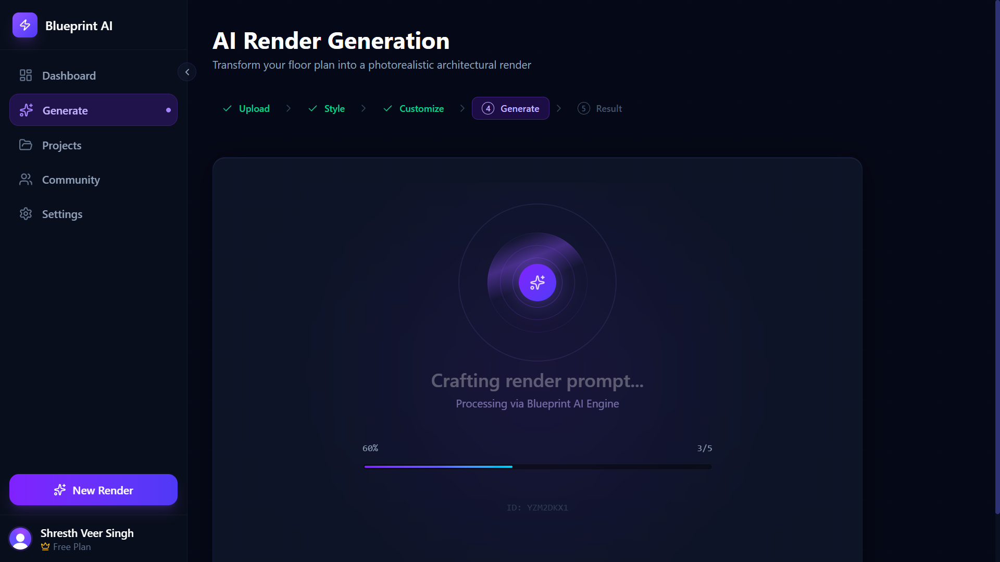
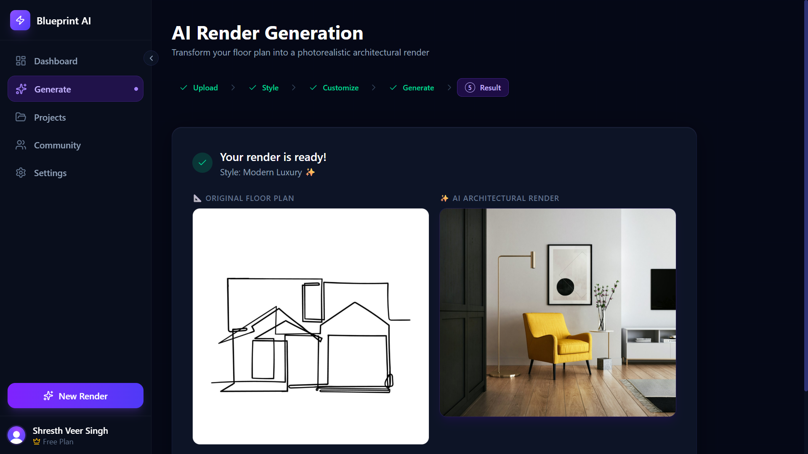

# 🏗️ BluePrint AI

### AI-Powered Architectural Visualization SaaS Platform

Transform traditional 2D architectural floor plans into photorealistic architectural visualizations using Generative AI.



---

## 🚀 Live Demo

🔗 https://blue-print-ai-five.vercel.app

---

# 🎯 Problem Statement

Traditional architectural visualization workflows are:

- Expensive
- Time consuming
- Require specialized software
- Difficult for clients to visualize
- Resource intensive

BluePrint AI solves this problem by leveraging Generative AI to automatically transform architectural sketches and floor plans into realistic architectural visualizations within seconds.

The platform enables architects, designers, builders, and homeowners to rapidly prototype architectural concepts without requiring complex rendering software.

---

# 🛠 Tech Stack

| Category | Technologies |
|----------|-------------|
| Frontend | Next.js, React.js, TypeScript |
| Backend | Node.js |
| Database | PostgreSQL |
| ORM | Prisma ORM |
| Authentication | Clerk |
| AI | Gemini AI |
| Storage | Cloudinary |
| State Management | Zustand |
| Styling | Tailwind CSS |
| Deployment | Vercel |

---

# ✨ Features

- 🤖 AI-powered architectural render generation
- 🏠 Interior and exterior visualization
- ☁️ Cloud project storage
- 🔐 Secure authentication and authorization
- ⚡ Real-time rendering progress tracking
- 🎨 Multi-style architectural generation
- 👥 Community showcase
- 📤 HD export and sharing
- 📱 Fully responsive dashboard
- 📊 Project analytics dashboard

---

## 📸 Features Showcase



---

# 🏛️ System Architecture

```text
                    User
                      │
                      ▼
              Next.js Frontend
                      │
                      ▼
               Clerk Authentication
                      │
                      ▼
                  API Routes
                      │
                      ▼
                 Gemini AI
                      │
                      ▼
                 Cloudinary
                      │
                      ▼
               PostgreSQL DB
                      │
                      ▼
                 Prisma ORM
```

---

# 🔄 Application Workflow

```text
Upload Floor Plan
        │
        ▼
User Authentication
        │
        ▼
Image Upload
        │
        ▼
AI Analysis
        │
        ▼
Render Generation
        │
        ▼
Cloud Storage
        │
        ▼
Project Dashboard
```

---

## ⚙️ Workflow Visualization



---

# 📊 Dashboard

BluePrint AI provides a modern SaaS dashboard for managing renders, projects, credits, and community engagement.



---

# 🤖 AI Rendering Pipeline

The rendering engine performs:

- Floor plan analysis
- Style extraction
- Prompt engineering
- AI image generation
- Render optimization
- Asset storage

Real-time progress indicators allow users to monitor the rendering workflow.



---

# ✨ Final AI Generated Result

Below is an example of the AI transforming a simple floor plan into a photorealistic architectural visualization.



---

# 📂 Project Structure

```bash
BluePrint-AI
│
├── app
├── components
│   └── landing
├── hooks
├── lib
├── prisma
├── public
│   └── screenshots
├── store
├── types
│
├── middleware.ts
├── next.config.ts
├── package.json
└── README.md
```

---

# 💡 Technical Highlights

✔ Developed a production-ready AI SaaS platform

✔ Integrated Gemini AI for architectural visualization

✔ Implemented secure authentication using Clerk

✔ Designed scalable REST API architecture

✔ Managed cloud media using Cloudinary

✔ Utilized PostgreSQL with Prisma ORM

✔ Built responsive UI using Next.js and Tailwind CSS

✔ Implemented global state management using Zustand

✔ Deployed application on Vercel

---

# 📚 Key Learnings

This project helped me gain practical experience in:

- Full-stack SaaS architecture
- Generative AI integration
- Cloud storage management
- Authentication systems
- Database design
- State management
- Prompt engineering
- Production deployment
- Performance optimization
- Scalable frontend architecture

---

# 🚀 Future Enhancements

- Video walkthrough generation
- AR/VR visualization
- Multi-floor support
- Team collaboration
- Payment integration
- AI customization presets
- Analytics dashboard
- Real-time collaboration

---

# ⚙️ Installation

Clone the repository:

```bash
git clone https://github.com/Shresth2929/BluePrint-AI.git
```

Navigate to project:

```bash
cd BluePrint-AI
```

Install dependencies:

```bash
npm install
```

Create environment variables:

```env
DATABASE_URL=

NEXT_PUBLIC_CLERK_PUBLISHABLE_KEY=
CLERK_SECRET_KEY=

GEMINI_API_KEY=

CLOUDINARY_CLOUD_NAME=
CLOUDINARY_API_KEY=
CLOUDINARY_API_SECRET=
```

Run development server:

```bash
npm run dev
```

Open:

```bash
http://localhost:3000
```

---

# 👨‍💻 Author

### Shresth Veer Singh

- GitHub: https://github.com/Shresth2929
- LinkedIn: https://www.linkedin.com/in/shresth-veer-singh/
- Portfolio: https://portfolio-three-sand-77.vercel.app/

---

⭐ If you found this project interesting, consider giving it a star.
